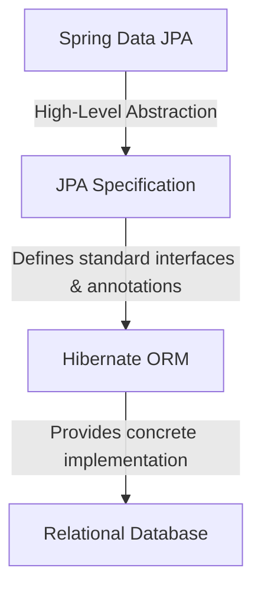

# Difference between JPA, Hibernate, and Spring Data JPA

This document outlines the core differences, relationships, and code comparison between Java Persistence API (JPA), Hibernate, and Spring Data JPA.

---

## High-Level Comparison & Architecture



### Summary of Differences

| Feature | JPA | Hibernate | Spring Data JPA |
| :--- | :--- | :--- | :--- |
| **What is it?** | A Java EE/Jakarta EE specification for ORM. | A concrete ORM framework that implements JPA. | An abstraction framework built on top of a JPA provider. |
| **Implementation** | No implementation (just standard guidelines & interfaces). | Contains the actual engine that handles DB sessions & SQL generation. | No JPA engine; it acts as a facade to reduce repository boilerplate code. |
| **Key Concepts** | `EntityManager`, `@Entity`, `@Id`, `persistence.xml`. | `SessionFactory`, `Session`, `Transaction`, HQL/HCQL. | `Repository`, `JpaRepository`, `@Transactional`. |
| **Provider Role** | The standard API. | The persistence provider. | The repository abstraction. |

---

## Detailed Explanations

### 1. Java Persistence API (JPA)
JPA is a **specification** (JSR 338) that defines how Java objects are mapped to relational database tables. Because it is a specification, it does not write data itself; it only provides guidelines, interfaces, and annotations (e.g., `@Entity`, `@Table`, `@Id`, `@Column`) that database persistence tools must implement.

### 2. Hibernate
Hibernate is a **concrete implementation** of the JPA specification. When you write JPA code, you are calling standard JPA interfaces, but Hibernate executes the actual database reads, writes, and SQL translations behind the scenes. 
*   Hibernate also includes features outside of the official JPA spec (such as native Session, Caching strategies, and Hibernate Criteria).

### 3. Spring Data JPA
Spring Data JPA is a **higher abstraction layer** that sits on top of JPA providers (typically Hibernate). It is designed to completely eliminate boilerplate data access object (DAO) code.
*   By extending interfaces like `JpaRepository` or `CrudRepository`, Spring Data JPA automatically generates implementation classes at runtime.
*   It handles database query creation dynamically based on method names (e.g., `findByEmail(String email)`).

---

## Code Comparison: Saving an Employee

Below is a side-by-side comparison illustrating how Spring Data JPA reduces database boilerplate code compared to pure Hibernate.

### 1. Hibernate Approach (Verboses & Boilerplate-heavy)
In traditional Hibernate, you must manually manage session factories, sessions, transaction boundaries, catch exceptions to trigger rollbacks, and close resources in a `finally` block:

```java
/* Method to CREATE an employee in the database using Hibernate */
public Integer addEmployee(Employee employee) {
    Session session = factory.openSession();
    Transaction tx = null;
    Integer employeeID = null;
    
    try {
        tx = session.beginTransaction();
        employeeID = (Integer) session.save(employee); 
        tx.commit();
    } catch (HibernateException e) {
        if (tx != null) tx.rollback();
        e.printStackTrace(); 
    } finally {
        session.close(); 
    }
    return employeeID;
}
```

### 2. Spring Data JPA Approach (Clean & Declarative)
Using Spring Data JPA, you only need to define a simple interface. Spring automatically generates the underlying query and session-management logic.

#### Step A: Declare Repository Interface
```java
// Spring Data JPA automatically provides standard CRUD implementations at runtime
public interface EmployeeRepository extends JpaRepository<Employee, Integer> {
}
```

#### Step B: Use in Service layer
```java
@Service
public class EmployeeService {

    @Autowired
    private EmployeeRepository employeeRepository;

    // Transaction boundaries are handled declaratively by Spring
    @Transactional
    public void addEmployee(Employee employee) {
        employeeRepository.save(employee);
    }
}
```
Notice how Spring Data JPA replaces manual session lifecycle management and catch-rollback structures with a single `@Transactional` annotation.
